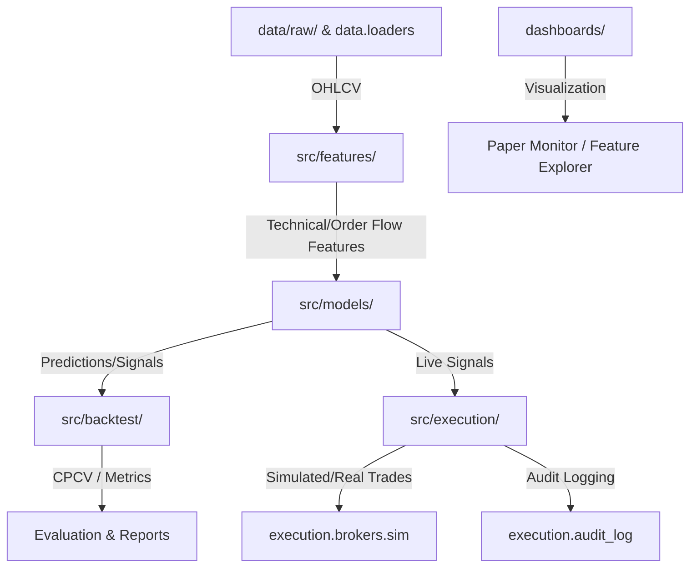

# AITrader AGENTS.md

## Install
```bash
pip install -e ".[dev,live_data,dashboard]"
pre-commit install  # run once after cloning
```
ML extras (`ml`, `backtest`, `viz`) and broker extras are separate groups.

## Test / Lint / Typecheck
Order matters in CI:
```bash
ruff check src tests scripts
ruff format --check src tests scripts
mypy src            # note: CI ignores missing imports but mypy is strict on defs
pytest tests -v --tb=short
```
Coverage gate is 50 % (`--cov-fail-under=50`).

**Quirk:** set `PYTHONPATH=src` and `CONFIG_DIR=$(pwd)/config` when running pytest outside of docker (already baked into `pytest.ini` for `pythonpath`, but `CONFIG_DIR` is not).

## Run a single test
```bash
pytest tests/unit/test_config.py -v
pytest tests/integration/test_execution.py::test_name -v
```

## Config & secrets
- Config lives in `config/{dev,staging,prod}.yaml`.
- Load with `src/config.py:AppConfig.from_env()` or `load_config()`; it reads `CONFIG_DIR` and `ENV`.
- **No secrets in YAML.** Broker keys go in `.env` (see `.env.example`). Never commit `.env`.

## Real data prerequisite
Integration/e2e tests that touch the data pipeline expect fixture files or real data. If missing, run:
```bash
python scripts/download_sample_data.py
```
Stored under `data/raw/`.

## Package layout (src only)
- `src/data/` — ingestion / loaders
- `src/features/` — technical indicators, regime detection
- `src/models/` — model registry + factories; `model_type` in config selects architecture
- `src/backtest/` — CPCV + walk-forward runner
- `src/execution/` — risk manager, circuit breaker, position manager, broker sim
- `src/api/` — placeholder (not wired)

## Style / lint rules
- ruff selects `E F I UP B C4`; `E501` is ignored (line length is 100, enforced by `ruff-format`).
- mypy: `disallow_untyped_defs`, `warn_unused_ignores`, `ignore_missing_imports`.

## Docker dev
```bash
./docker/docker_dev_build.sh     # once
./docker/docker_dev_test.sh
./docker/docker_dev_shell.sh
./docker/docker_dev_paper.sh     # --capital optional
./docker/docker_dev_dashboards.sh
```
Docker sets `PYTHONPATH=/app/src`, `CONFIG_DIR=/app/config`. Test scripts set same env.

## Scripts
Common entrypoints:
- `scripts/start_webui.sh`, `scripts/stop_webui.sh`, `scripts/status_paper.sh`
- `scripts/run_backtest.py`
- `scripts/train_model.py`, `scripts/train_all.py`

Dashboards: `dashboards/paper_monitor.py` (8501), `dashboards/feature_explorer.py` (8502).

## Type-check caveat
Third-party libraries (torch, xgboost, lightgbm, arch, etc.) lack stubs; ignore mypy failures on external imports. Internal code is expected to stay typed.

## Repository Map & Onboarding Reference

To quickly verify configuration, directory status, active datasets, and model registry status in a new session, run:
```bash
python3 scripts/project_overview.py
```

### Architecture Diagram


### Primary Module & Class Map
- **Config:** `src/config.py` - Pydantic config validation for app, data, models, risk, execution settings.
- **Data Loaders & Processing:**
  - `src/data/loaders/csv_loader.py` - OHLCV data loader.
  - `src/data/loaders/live_data.py` - Live yfinance fetching.
- **Feature Engineering:**
  - `src/features/feature_engine.py` - Combines indicators and filters.
  - `src/features/regime_detector.py` - Market regime classification.
  - `src/features/technical_indicators.py` - Traditional technical indicators.
  - `src/features/order_flow_signals.py` - High-frequency order flow features.
  - `src/features/causal_validator.py` - Causal feature validation/filtering.
- **Models:**
  - `src/models/model_registry.py` - Tracks model checkpoint files, metadata JSONs, promotions (`dev` -> `staging` -> `prod`).
  - `src/models/model_factory.py` - Model instantiation factory.
  - `src/models/lstm_transformer.py` - LSTM + Transformer model (`LSTMTransformerModel`).
  - `src/models/enhanced_transformer.py` - Self-attention-based sequence predictor.
  - `src/models/garch_gru.py` - GRU recurrent neural net with GARCH volatility modeling.
  - `src/models/meta_labeler.py` - Second-stage model sizing classifier.
  - `src/models/ensemble.py` - Ensembles multiple predictions.
- **Backtesting:**
  - `src/backtest/engine.py` - Standard backtesting logic (`BacktestEngine`).
  - `src/backtest/walk_forward.py` - Walk-forward model optimization validator.
  - `src/backtest/cpcv.py` - Combinatorial Purged Cross-Validation.
- **Execution & Risk:**
  - `src/execution/engine.py` - Handles order placement and portfolio loop (`ExecutionEngine`).
  - `src/execution/brokers/sim.py` - Simulated paper-trading broker (`SimBroker`).
  - `src/execution/position_manager.py` - Tracks active trades and sizes.
  - `src/execution/risk_manager.py` - Validates trading rules (daily drawdowns, limits).
  - `src/execution/circuit_breaker.py` - Circuit breakers to stop trading if limits are violated.
  - `src/execution/audit_log.py` - Production-grade structured event logging.
