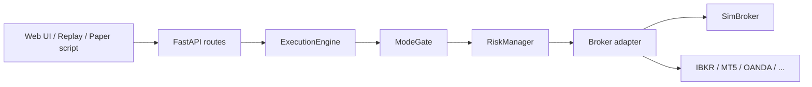

# Broker Integration Roadmap

**Status:** Planning / not implemented  
**Last updated:** 2026-06-24  
**Audience:** Feature developers wiring demo or live forex execution into AITrader

This document captures the current execution landscape, why OANDA was the first planned
adapter, regional constraints (including South Korea and Uzbekistan), alternative brokers,
and a recommended implementation order for D06-EXECUTION.

> **Not legal advice.** Residency, tax, and broker regulation must be verified independently
> before opening or funding any account.

---

## 1. Current state (what works today)

| Mode | Entry point | Execution | Real broker? |
|------|-------------|-----------|--------------|
| **Replay Studio** | `frontend` → `POST /api/replay/*` | `MockExecutionEngine` | No |
| **Paper trading** | `scripts/run_paper.py` | `SimBroker` | No |
| **Vector / walk-forward backtest** | `src/backtest/` | Simulated fills | No |

All order flow today ends in **simulation**:

- `src/execution/brokers/sim.py` — `SimBroker` (paper)
- `src/backtest/engine/event_driven.py` — `MockExecutionEngine` (replay)

There is **no** live order adapter in `src/execution/brokers/` except `sim.py`.

### Existing plumbing (ready for adapters)

| Piece | Location | Notes |
|-------|----------|-------|
| Broker protocol | `src/execution/brokers/base.py` | `submit_order`, positions, portfolio value |
| Execution engine | `src/execution/engine.py` | Currently hard-wired to `SimBroker` |
| Live mode gate | `src/execution/mode_gate.py` | Requires `LIVE_TRADING_CONFIRMED=YES` + `env: prod` |
| Env template | `.env.example` | `BROKER_API_URL`, `BROKER_API_KEY`, `BROKER_ACCOUNT_ID` |
| Prod config intent | `config/prod.yaml` | `broker: oanda` (config only) |
| Division plan | `DEV_PLAN/D06-EXECUTION.md` | Phase 5+ live broker work |

### OANDA today = data only

OANDA is used for **historical candle download** (not live orders):

- `src/data/loaders/historical/oanda.py`
- Practice URL: `api-fxpractice.oanda.com`
- Live URL: `api-fxtrade.oanda.com`

Credentials can be reused for a future order adapter, but **order submission is not built**.

---

## 2. Why OANDA was planned first

OANDA v20 REST is a straightforward fit for this codebase:

- REST JSON (orders, positions, account)
- Well-documented practice (demo) environment
- Matches the planned `brokers/oanda.py` shape in `DEV_PLAN/D06-EXECUTION.md`
- `.env.example` already uses practice API URL

**Blocker for some users:** OANDA does not accept clients in all countries. If account
opening fails due to **region restrictions**, treat OANDA as one adapter option — not a
hard dependency.

---

## 3. Regional notes: South Korea (KR) vs Uzbekistan (UZ)

### South Korea

- Retail **margin FX** rules are strict and have tightened further for residents.
- International brokers may accept Korean residents for **some** products while restricting
  margin forex or CFDs.
- **Do not assume** EUR/USD-style retail FX access until confirmed in the broker portal
  after account open.
- Verify: [Interactive Brokers country list](https://www.interactivebrokers.com/en/accounts/open-account-country-list.php)
  and local regulatory guidance before funding.

### Uzbekistan

- More retail forex brokers market to UZ residents (often **MetaTrader 5**).
- Offshore-regulated brokers are common; **due diligence** on regulation, deposits, and
  withdrawals is essential.
- API/automation terms vary by broker — read ToS for algorithmic trading.

### Practical account-opening strategy

1. Try **IBKR paper** (if country supported) — best long-term API fit for this project.
2. In parallel, open an **MT5 demo** with any broker that accepts your residency.
3. Optionally evaluate **Dukascopy** (JForex) — aligns with existing historical data paths.
4. Keep using **Replay Studio + paper sim** while broker access is sorted.

---

## 4. Alternative brokers (feature-dev comparison)

| Broker | API style | Demo/paper | AITrader fit | Region notes | Adapter effort |
|--------|-----------|------------|--------------|--------------|----------------|
| **Interactive Brokers** | TWS API / Web API | Paper account | **Best** — mature algo ecosystem; mentioned in `go-live-checklist.md` | Check official country list for KR/UZ | Medium |
| **MetaTrader 5** | Python `MetaTrader5` + terminal | Widely available demos | Good for UZ; **different architecture** (terminal bridge) | Common in UZ/CIS | Medium–high |
| **Dukascopy** | JForex API | Demo available | Good — historical loader already uses Dukascopy fallback | Verify residency | Medium |
| **OANDA** | REST v20 | Practice account | Originally planned; simple REST | Blocked in some regions | Medium (planned) |
| **FXCM** | REST (legacy) | Varies | Mentioned in `data-sources.md` | Verify current API status | Unknown |

### Not recommended as primary targets

- Binary / short-expiry platforms — product mismatch vs FX spot/CFD execution model.
- Crypto exchanges — different asset class unless project scope expands.
- Unverified “API forex” sites without clear regulation and withdrawal history.

---

## 5. Recommended paths by goal

| Goal | What to use now | Next broker to implement |
|------|-----------------|--------------------------|
| Strategy + chart practice | Replay Studio, `SimBroker` | — |
| Live **prices**, sim **fills** | `scripts/run_paper.py` (yfinance) | Optional: broker price feed later |
| Demo **real fills** (engineering-first) | — | **IBKR** paper adapter |
| Demo if IBKR unavailable (esp. UZ) | — | **MT5** adapter |
| Leverage existing data code | — | **Dukascopy** JForex adapter |
| Production live money | — | Same as demo adapter + `mode_gate` + `go-live-checklist.md` |

**Suggested default order for new adapters:**

1. `brokers/ibkr.py`
2. `brokers/mt5.py`
3. `brokers/dukascopy.py` (JForex)
4. `brokers/oanda.py` (when/if account is available)

---

## 6. Architecture: how a broker plugs in

### Broker protocol (`src/execution/brokers/base.py`)

Adapters must implement:

- `submit_order(order, on_event)` — async lifecycle via `OrderEvent` callback
- `get_position(instrument)` / `get_all_positions()`
- `get_portfolio_value(prices)`
- `update_price(instrument, price)` — for mark-to-market where applicable

### Config / secrets

| Setting | Source | Notes |
|---------|--------|-------|
| `BROKER_API_URL` | `.env` | Base URL (practice vs live) |
| `BROKER_API_KEY` | `.env` | Never commit |
| `BROKER_ACCOUNT_ID` | `.env` | Broker-specific |
| `execution_mode` | `config/{env}.yaml` | `paper` vs `live` |
| `LIVE_TRADING_CONFIRMED` | Shell env only | Must be `YES` for live (`mode_gate.py`) |

### Replay Studio caveat

Replay manual orders today go through `MockExecutionEngine`, **not** `ExecutionEngine` /
`SimBroker`. Connecting a real broker to the Replay UI is a **separate wiring task**:

- New execution mode (e.g. `replay_live`) or
- Route manual orders from `src/api/routes/replay.py` to `ExecutionEngine` with a live
  broker instance

Keep replay on sim by default to avoid lookahead and accidental live orders.

---

## 7. Implementation phases (feature dev)

Aligns with `DEV_PLAN/D06-EXECUTION.md` and `docs/go-live-checklist.md`.

### Phase A — Foundation (no real money)

- [ ] Broker factory: select adapter from `config.execution.broker` (`mock` | `ibkr` | `mt5` | …)
- [ ] Refactor `ExecutionEngine` to accept `Broker` protocol (not only `SimBroker`)
- [ ] Integration tests with mock HTTP server per adapter
- [ ] Position persistence before any live test (`positions.json` — see D06 known risks)

### Phase B — First real adapter (demo only)

Pick **one** broker after confirming account opens in your region.

**IBKR (preferred if account opens):**

- [ ] `src/execution/brokers/ibkr.py`
- [ ] Paper account: place/cancel market and limit orders
- [ ] Map `Instrument` ↔ IBKR contract IDs (forex pairs)
- [ ] Subscribe to fills → `OrderEvent` on bus
- [ ] `scripts/run_paper.py` flag: `--broker ibkr`

**MT5 (fallback for UZ / OANDA-blocked regions):**

- [ ] `src/execution/brokers/mt5.py`
- [ ] Document requirement: MT5 terminal running (host or sidecar)
- [ ] Demo account smoke test
- [ ] Handle symbol naming (`EURUSD` vs `EURUSD.a`)

**Dukascopy (optional):**

- [ ] `src/execution/brokers/dukascopy.py` via JForex API
- [ ] Reuse instrument mapping from `src/data/loaders/historical/`

**OANDA (optional when region allows):**

- [ ] `src/execution/brokers/oanda.py` — OANDA v20 REST
- [ ] Practice account integration tests

### Phase C — Live gate

- [ ] `mode_gate.py` enforced in all entrypoints
- [ ] `env: prod` + `LIVE_TRADING_CONFIRMED=YES` documented in runbook
- [ ] Circuit breaker + risk manager validated on demo for ≥ 4–6 weeks
- [ ] Complete `docs/go-live-checklist.md`

### Phase D — UI (optional)

- [ ] Trading Terminal / Replay: explicit **SIM vs LIVE** badge
- [ ] Manual trading route policy (sim-only vs broker-backed)
- [ ] WebSocket portfolio sync from real broker positions

---

## 8. Adapter design notes per broker

### IBKR

- **Pros:** Institutional-grade API, paper trading, multi-asset, good Python community
  (`ib_insync`, official `ibapi`).
- **Cons:** Complexity (sessions, contract definitions, pacing); forex product access
  varies by residency.
- **Files to add:** `brokers/ibkr.py`, `brokers/ibkr_contracts.py`, tests with paper gateway.

### MT5

- **Pros:** Easy demo accounts in many regions; official Python package.
- **Cons:** Requires terminal process; less “pure cloud REST”; broker-specific symbols.
- **Files to add:** `brokers/mt5.py`, `docs/mt5-terminal-setup.md` (operational runbook).

### Dukascopy

- **Pros:** Already used for historical candles in data pipeline.
- **Cons:** JForex API learning curve; residency checks required.
- **Files to add:** `brokers/dukascopy.py`.

### OANDA

- **Pros:** Simple REST; practice environment; env vars already in `.env.example`.
- **Cons:** Regional restrictions; only REST forex focus.
- **Files to add:** `brokers/oanda.py` (as originally planned in D06).

---

## 9. Testing strategy

| Layer | What to test |
|-------|----------------|
| Unit | Order mapping, error parsing, retry/backoff |
| Integration | Demo account: open → place → fill/cancel → close (recorded fixtures) |
| Safety | `mode_gate` rejects live without `LIVE_TRADING_CONFIRMED` |
| Replay isolation | Assert replay sessions never instantiate live broker unless explicit flag |
| Soak | Paper/demo loop 2+ weeks per `go-live-checklist.md` |

Never run live integration tests in CI. Use demo/paper credentials in a manual or
scheduled staging job only.

---

## 10. Related documents

| Doc | Purpose |
|-----|---------|
| `DEV_PLAN/D06-EXECUTION.md` | Division scope, module layout, phase plan |
| `docs/go-live-checklist.md` | Pre-live validation checklist |
| `docs/data-sources.md` | OHLCV sources (OANDA, FXCM mention) |
| `docs/QUICKSTART-PAPER-TRADING.md` | Sim paper trading today |
| `.env.example` | Broker env var template |
| `src/execution/mode_gate.py` | Live trading safety gate |

---

## 11. Open decisions (TODO for implementers)

1. **Default first adapter:** IBKR vs MT5 — decide after account-opening tests for target
   residency (KR/UZ).
2. **Replay + live:** Whether Replay Studio stays sim-only permanently or gets an opt-in
   live mode.
3. **Price feed:** Single broker for both data and execution vs yfinance + broker execution.
4. **Instrument map:** Central registry for broker symbol ↔ `Instrument` enum.
5. **MT5 deployment:** Local terminal vs headless sidecar in Docker (non-trivial).

---

## 12. Summary

- **Today:** All trading is simulated. No demo or live forex account is connected.
- **OANDA blocked:** Not a project blocker — implement any `Broker` adapter instead.
- **KR:** Prefer IBKR if eligible; confirm FX product access; expect stricter rules.
- **UZ:** MT5 demo is often the fastest path to real fills; IBKR still worth trying.
- **Next code milestone:** Broker factory + first adapter on **demo/paper only**, then
  `go-live-checklist.md` before real money.